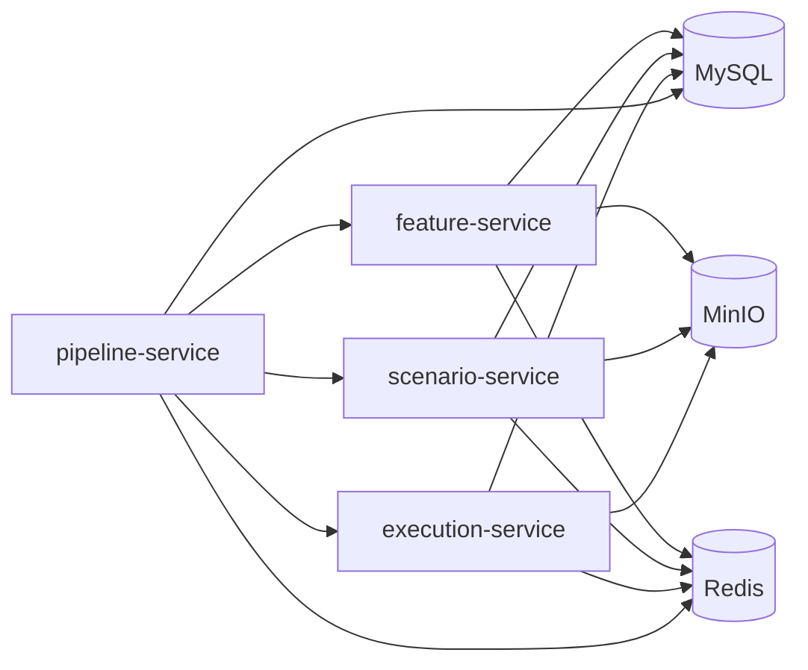
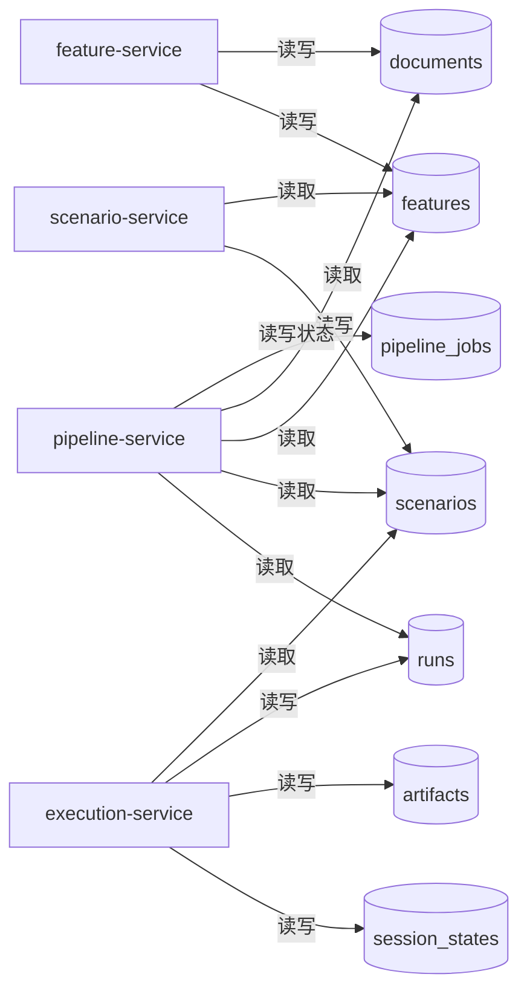
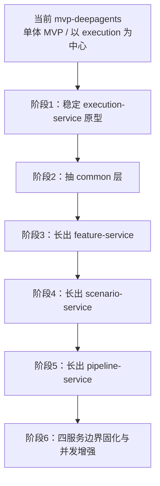
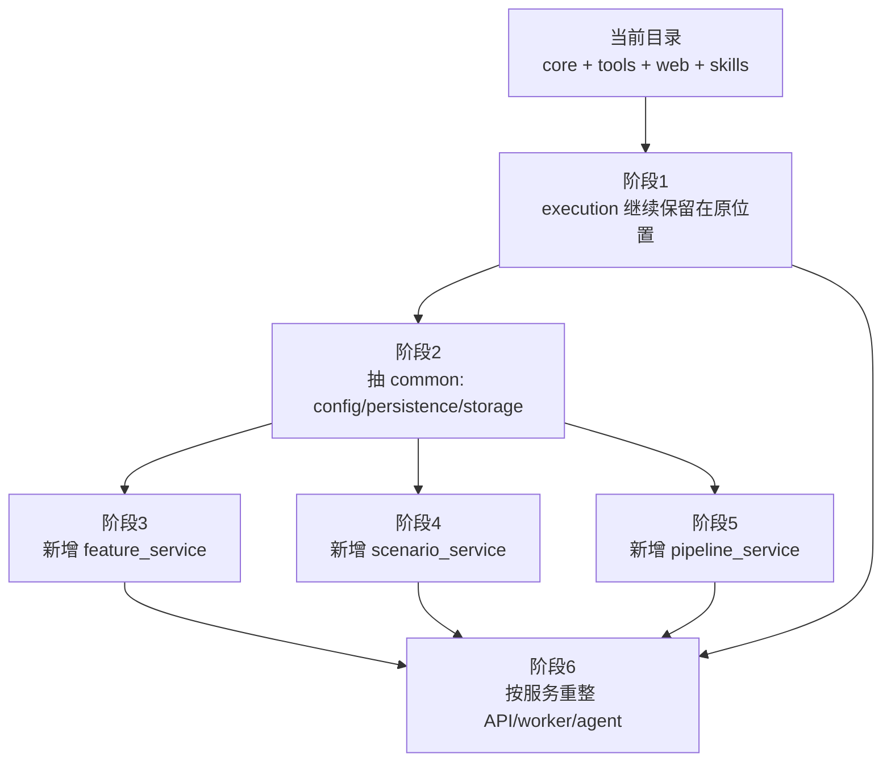
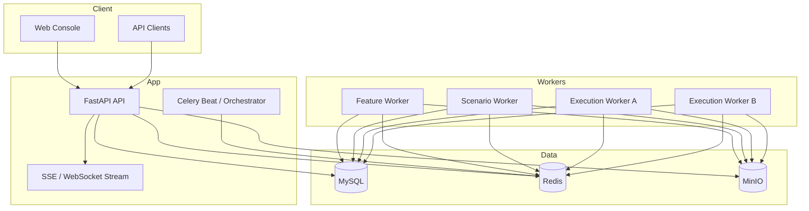
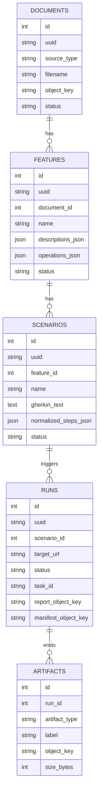
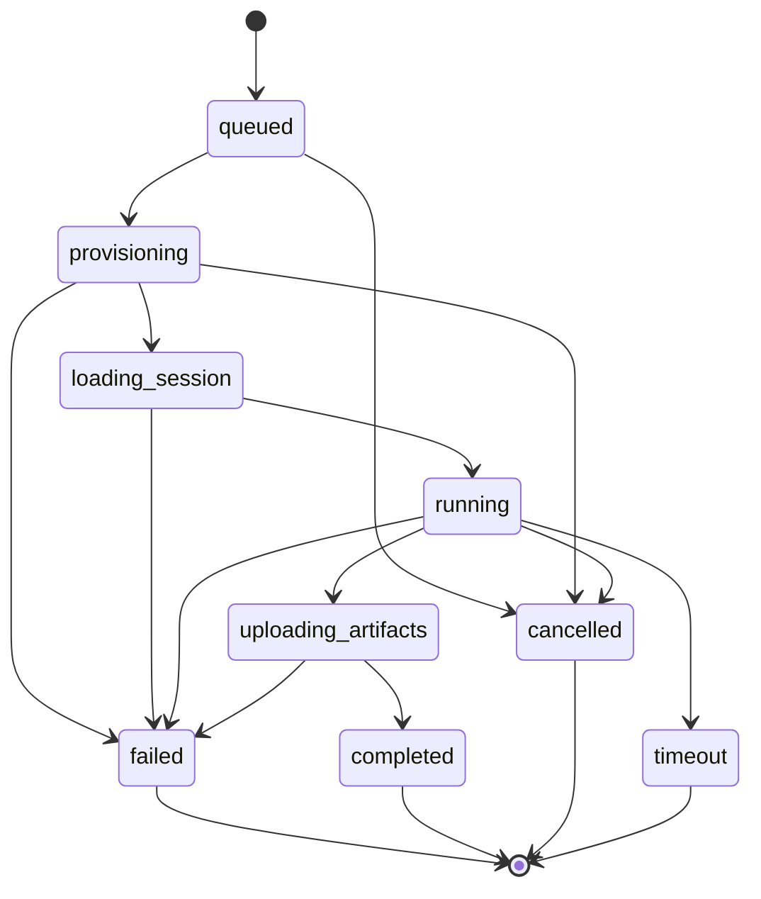
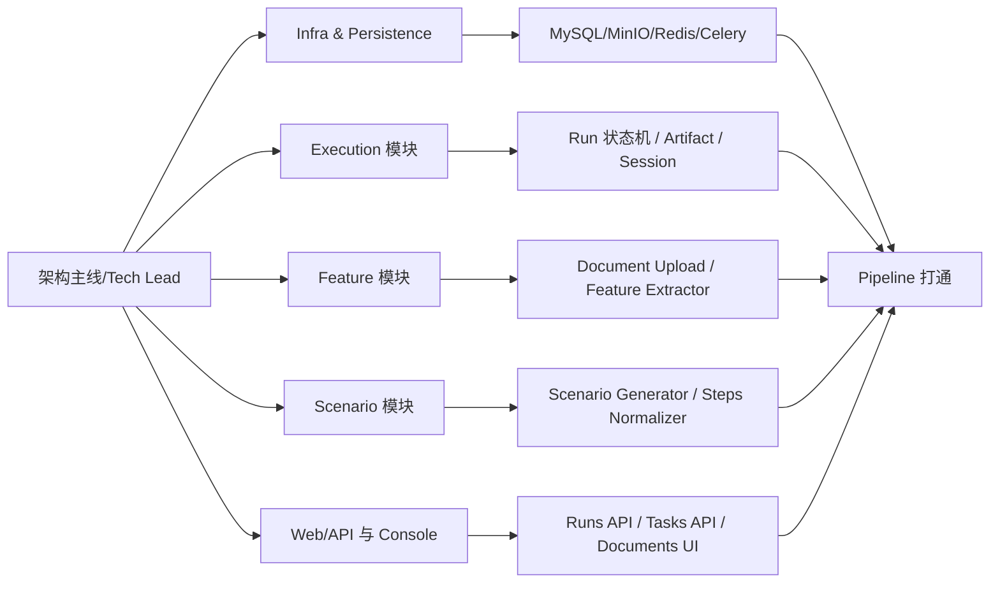

# Context

你当前要做的，不是给 `mvp-deepagents` 补几个接口，而是把它从一个“单模块 Web 自动测试 MVP”，演进成一个可长期维护、可多人协作、可支持并发测试的三模块系统，并最终承接 `webtestpilot` 中 `run_testcase` 主链路的重构迁移职责。

目标仓库：
- `C:\Users\ZhuanZ\Desktop\Projects_China_mobile\mvp-deepagents`

对标仓库：
- `C:\Users\ZhuanZ\Desktop\Projects_China_mobile\WebTestPilot-China-Mobile\webtestpilot`

你的真实目标不是“复制老系统”，而是：

1. 以 `mvp-deepagents` 为**新主载体**。
2. 保留 `mvp-deepagents` 当前已经有价值的 Deep Agents 执行内核。
3. 借鉴 `webtestpilot` 在 **MySQL / MinIO / Celery / Redis / pipeline 编排 / 任务状态管理** 上的经验。
4. 把系统整理成后续多人都能继续推进的稳定架构。
5. 先把自动化测试模块做稳，再逐步把 feature/scenario 上游补齐。

---

# 0. 当前事实基线（基于已读代码）

## 0.1 `mvp-deepagents` 当前已具备什么

### 已有能力
- Deep Agents 执行内核
  - `mvp-deepagents/src/webtestagent/core/agent_builder.py`
  - `mvp-deepagents/src/webtestagent/core/runner.py`
- Playwright CLI browser tools
  - `mvp-deepagents/src/webtestagent/tools/browser_tools.py`
- artifact manifest 管理
  - `mvp-deepagents/src/webtestagent/core/artifacts.py`
- 登录态 session persistence
  - `mvp-deepagents/src/webtestagent/core/session.py`
- FastAPI + SSE 的 run 查询与控制台
  - `mvp-deepagents/src/webtestagent/web/api.py`
  - `mvp-deepagents/src/webtestagent/web/routers/runs.py`
  - `mvp-deepagents/src/webtestagent/web/services/run_store.py`
- 场景输入支持两种形式
  - fuzzy scenario
  - structured steps
  - `mvp-deepagents/src/webtestagent/config/scenarios.py`

### 当前核心短板
- 没有 feature 生成模块
- 没有 scenario 生成模块
- 没有 MySQL 持久化
- 没有 MinIO 大对象存储
- 没有 Redis/Celery 异步执行层
- 当前 run 状态主要依赖内存态 `RunStore`
- 当前并发模型主要是**单机线程 + 本地目录输出**
- API 重启后虽然磁盘工件还在，但任务状态管理并不完整
- 不适合多人协作长期扩展

## 0.2 `webtestpilot` 当前有哪些可借鉴的成熟能力

### 三段链路清晰
- `gen_feature/tasks/gen_feature.py`
- `gen_scenario/worker.py`
- `gen_testcase/worker.py` + `run_testcase/worker.py`

### 基础设施与编排成熟
- `shared/celery_app.py`
- `api/routers/document.py`
- `api/routers/PRD_Parser.py`
- `api/routers/task.py`
- `docker-compose.base.yml`
- `shared/entities/mysql_model.py`

### 但不建议照搬的部分
- `run_testcase/worker.py` 的执行模型更偏旧系统产物，不应替换当前 Deep Agents 内核
- `gen_testcase/worker.py` 的 VLM + Playwright 生成方式也不应直接回搬
- SQL dump 初始化 schema 的方式不适合新系统长期维护

---

# 1. 总体推荐策略

## 1.1 一句话策略

**以 `mvp-deepagents` 当前的执行内核为中心，优先把“自动化测试执行模块”平台化，再逐步迁入 feature/scenario 两个上游模块；底层统一引入 MySQL + MinIO + Redis + Celery，形成可恢复、可查询、可并发、可协作的三模块系统。**

## 1.2 为什么不是整仓复制 `webtestpilot`

因为你的新系统已经有一套更适合当前方向的执行骨架：
- Deep Agents
- browser tools
- manifest artifact
- session persistence
- web console / SSE

这些是新系统最宝贵的资产。

老系统真正值得复用的是：
- 领域实体主线
- 异步编排方式
- 存储分层思路
- 任务状态查询模式

所以应该是：
- **复用概念和边界**
- **迁移业务能力和数据模型**
- **重写具体执行承载层**

---

# 2. 最终目标系统架构

## 2.1 目标能力边界

最终系统对外应稳定提供三大模块：

1. **Feature 生成模块**
   - 输入：PRD / Markdown / PDF / 结构化需求材料
   - 输出：Feature 列表、实体、规则、操作语义

2. **Scenario 生成模块**
   - 输入：Feature
   - 输出：Gherkin 场景 + 标准化步骤

3. **自动化测试模块**
   - 输入：Scenario / Steps / URL / BrowserConfig / SessionConfig
   - 输出：run 状态、report、artifact、错误证据、截图、快照、日志

### 2.1.1 服务划分建议：三模块应拆成独立服务

针对你刚刚补充的要求，推荐结论是：

**是的，最终应明确拆成三个独立服务，三套独立 agent，不建议做成一个大一统服务里共用同一套 skills / prompts / agent context。**

推荐拆分为：

#### A. feature-service
- 只负责：
  - 文档上传/接入
  - 文档标准化
  - Feature 提取
  - Feature 存储
- 不负责：
  - Scenario 生成
  - 自动执行
- 使用独立：
  - agent builder
  - prompts
  - skills
  - worker 队列

#### B. scenario-service
- 只负责：
  - 读取 Feature
  - 生成 Scenario
  - 生成 Gherkin
  - 标准化 steps
  - 存储 Scenario
- 不负责：
  - Feature 提取
  - 自动执行
- 使用独立：
  - agent builder
  - prompts
  - skills
  - worker 队列

#### C. execution-service
- 只负责：
  - 读取 Scenario 或 steps
  - 调度执行 run
  - Deep Agent 自动测试
  - browser tools 调用
  - artifact/report/session 管理
- 不负责：
  - Feature 提取
  - Scenario 生成
- 使用独立：
  - agent builder
  - prompts
  - skills
  - worker 队列

### 2.1.2 为什么必须拆开

这样最符合你的使用方式：

- 某一时间你可以**只跑 feature 提取**
- 某一时间你可以**只做 feature -> scenario**
- 某一时间你可以**只跑自动化测试**
- 三个模块的 agent 能力不会互相污染
- execution agent 不会加载 feature/scenario 的无关 skill
- feature/scenario 模块也不会携带执行模块里的浏览器操作上下文
- 不同同学可以分开维护、分开发布、分开扩容

### 2.1.3 三个服务之间是什么关系

这三个服务应该是：

- **逻辑上串联**
- **部署上解耦**
- **运行时独立**

它们共享：
- MySQL
- MinIO
- Redis / Celery broker
- 公共领域模型规范

但它们各自拥有：
- 独立 API
- 独立 worker
- 独立 task 入口
- 独立 agent builder
- 独立 skill 目录
- 独立 prompt 策略

### 2.1.4 推荐增加一个独立 pipeline-service

如果你希望一键跑全链路，那么不要让三个服务互相直接硬调用，而是建议单独增加：

#### D. pipeline-service（强烈建议）
- 只负责：
  - 编排
  - 任务流转
  - 阶段状态推进
  - 重试策略
- 不负责：
  - 具体 feature 提取
  - 具体 scenario 生成
  - 具体自动执行

也就是说：
- 日常你可以只调用 feature-service / scenario-service / execution-service 某一个
- 需要端到端时，再由 pipeline-service 串起来

### 2.1.5 推荐服务关系图



### 2.1.6 推荐调用原则

- `feature-service` 完成后，只写 Feature 结果，不主动隐式调用 execution
- `scenario-service` 只消费 Feature，生成 Scenario
- `execution-service` 只消费 Scenario 或外部传入的 steps
- `pipeline-service` 负责把它们按需要串起来

这样保证：
- 每一阶段都能单独运行
- 每一阶段都能单独回归测试
- 每一阶段都能独立替换 agent / skill / prompt
- 某个模块升级不会把其它模块一起带崩

### 2.1.7 agent 隔离建议

每个服务都必须有独立 agent 构建入口，不要共用一个“大 agent”。

推荐结构：

- `src/webtestagent/feature/agent_builder.py`
- `src/webtestagent/scenario/agent_builder.py`
- `src/webtestagent/execution/agent_builder.py`

并且各自有独立的 prompts / skills：

```text
src/webtestagent/
├─ feature/
│  ├─ agent_builder.py
│  ├─ prompts/
│  └─ skills/
├─ scenario/
│  ├─ agent_builder.py
│  ├─ prompts/
│  └─ skills/
└─ execution/
   ├─ agent_builder.py
   ├─ prompts/
   └─ skills/
```

### 2.1.9 四个服务的进一步细化设计

下面把你要的两部分进一步展开：

1. **四个服务各自的 API / 数据库读写边界 / Celery queue / 目录结构**
2. **这四个服务如何从当前 `mvp-deepagents` 一步一步拆出来**

---

## 2.1.10 feature-service 详细设计

### A. 职责
feature-service 只负责：
- 接收文档
- 文档标准化
- 需求抽取
- 生成 Feature
- 写入 Feature 相关数据

### B. 对外 API 建议

#### 1. 文档接入
- `POST /documents`
  - 上传 PDF / Markdown / text
  - 返回 `document_id`

#### 2. 触发 feature 提取
- `POST /documents/{document_id}/extract-features`
  - 创建异步任务
  - 返回 `task_id`

#### 3. 查询文档信息
- `GET /documents/{document_id}`

#### 4. 查询文档下的 feature 列表
- `GET /documents/{document_id}/features`

#### 5. 查询单个 feature
- `GET /features/{feature_id}`

#### 6. 可选：重跑 feature 提取
- `POST /features/{feature_id}/regenerate`

### C. 数据库读写边界

#### 可以读
- `documents`
- `features`
- 可选读取 `pipeline_jobs`

#### 可以写
- `documents`
- `features`
- `feature_extraction_logs`（可选）
- `pipeline_jobs`（仅更新自身阶段状态时）
- `async_tasks`（如果你单独建任务表）

#### 不应该写
- `scenarios`
- `runs`
- `artifacts`（除 feature 过程自身调试产物外）

### D. Celery 队列建议
- `feature_queue`
- 可选再拆：
  - `feature_ingestion_queue`
  - `feature_extract_queue`

### E. 目录结构建议

```text
src/webtestagent/feature/
├─ agent_builder.py
├─ prompts/
│  ├─ system.py
│  └─ user.py
├─ skills/
├─ loaders.py
├─ extractor.py
├─ schemas.py
├─ service.py
└─ tasks.py
```

### F. 依赖与 agent 特点
- 不需要浏览器 skill
- 不应加载 execution 的 browser tools
- 可以有 PDF parser、文档分块、结构化抽取等技能

---

## 2.1.11 scenario-service 详细设计

### A. 职责
scenario-service 只负责：
- 消费 Feature
- 生成 Scenario
- 生成 Gherkin
- 生成 normalized steps
- 存储 Scenario

### B. 对外 API 建议

#### 1. 从 feature 生成 scenario
- `POST /features/{feature_id}/generate-scenarios`
  - 返回 `task_id`

#### 2. 查询某 feature 下 scenario 列表
- `GET /features/{feature_id}/scenarios`

#### 3. 查询单个 scenario
- `GET /scenarios/{scenario_id}`

#### 4. 手工创建 scenario
- `POST /scenarios`

#### 5. 编辑 scenario
- `PATCH /scenarios/{scenario_id}`

#### 6. 重跑 scenario 生成
- `POST /scenarios/{scenario_id}/regenerate`

### C. 数据库读写边界

#### 可以读
- `features`
- `scenarios`
- 可选读取 `pipeline_jobs`

#### 可以写
- `scenarios`
- `scenario_generation_logs`（可选）
- `pipeline_jobs`（仅更新自身阶段状态时）

#### 不应该写
- `documents`
- `runs`
- `execution artifacts`

### D. Celery 队列建议
- `scenario_queue`
- 可选再拆：
  - `scenario_generate_queue`
  - `scenario_normalize_queue`

### E. 目录结构建议

```text
src/webtestagent/scenario/
├─ agent_builder.py
├─ prompts/
│  ├─ system.py
│  └─ user.py
├─ skills/
├─ generator.py
├─ normalizer.py
├─ schemas.py
├─ service.py
└─ tasks.py
```

### F. 依赖与 agent 特点
- 不需要浏览器执行环境
- 不需要 feature parser 的低层文档处理 skill
- 专注于：场景抽象、Gherkin、步骤标准化

---

## 2.1.12 execution-service 详细设计

### A. 职责
execution-service 只负责：
- 接收 scenario 或 steps
- 创建 run
- 调度执行
- 管理 session
- 产出 artifact/report
- 对外暴露 run 查询

### B. 对外 API 建议

#### 1. 创建 run
- `POST /runs`
  - 输入：scenario_id / steps / fuzzy text / url / browser config / session config
  - 返回：`run_id`, `task_id`

#### 2. 查询 run 列表
- `GET /runs`

#### 3. 查询 run 详情
- `GET /runs/{run_id}`

#### 4. 查询 manifest
- `GET /runs/{run_id}/manifest`

#### 5. 查询 report
- `GET /runs/{run_id}/report`

#### 6. 查询 artifacts
- `GET /runs/{run_id}/artifacts`

#### 7. 查询 latest screenshot
- `GET /runs/{run_id}/latest-screenshot`

#### 8. SSE / WS 实时事件
- `GET /runs/{run_id}/stream`

#### 9. 取消 run
- `POST /runs/{run_id}/cancel`

#### 10. rerun
- `POST /runs/{run_id}/rerun`

### C. 数据库读写边界

#### 可以读
- `scenarios`
- `runs`
- `artifacts`
- `session_states`
- 可选读取 `pipeline_jobs`

#### 可以写
- `runs`
- `artifacts`
- `session_states`
- `run_events`（如果你单独建事件表）
- `pipeline_jobs`（仅更新自身阶段状态时）

#### 不应该写
- `features` 的业务内容
- `documents` 的业务内容

### D. Celery 队列建议
- `execution_queue`
- 可选再拆：
  - `execution_prepare_queue`
  - `execution_run_queue`
  - `artifact_upload_queue`
  - `session_queue`

### E. 目录结构建议

```text
src/webtestagent/execution/
├─ agent_builder.py
├─ prompts/
│  ├─ system.py
│  └─ user.py
├─ skills/
├─ run_service.py
├─ report_service.py
├─ session_service.py
├─ schemas.py
└─ tasks.py
```

### F. 依赖与 agent 特点
- 这是唯一真正需要浏览器 skill 的服务
- 这是唯一需要 `browser_tools.py` 的服务
- 这是唯一需要 run state machine / session persistence 的服务

---

## 2.1.13 pipeline-service 详细设计

### A. 职责
pipeline-service 只负责：
- 编排 `feature-service -> scenario-service -> execution-service`
- 管理阶段推进
- 失败重试
- 一键全链路触发

### B. 对外 API 建议

#### 1. 创建 pipeline job
- `POST /pipelines`
  - mode:
    - `feature_only`
    - `feature_to_scenario`
    - `full_pipeline`

#### 2. 查询 pipeline job
- `GET /pipelines/{pipeline_id}`

#### 3. 查询 pipeline job 列表
- `GET /pipelines`

#### 4. 取消 pipeline
- `POST /pipelines/{pipeline_id}/cancel`

#### 5. 重试失败阶段
- `POST /pipelines/{pipeline_id}/retry`

### C. 数据库读写边界

#### 可以读
- `documents`
- `features`
- `scenarios`
- `runs`
- `pipeline_jobs`

#### 可以写
- `pipeline_jobs`
- `pipeline_stage_logs`（可选）
- `async_tasks`（可选）

#### 不应该直接写
- feature/scenario/run 的业务内容本体

### D. Celery 队列建议
- `pipeline_queue`
- 可选再拆：
  - `pipeline_orchestrate_queue`
  - `pipeline_retry_queue`

### E. 目录结构建议

```text
src/webtestagent/pipeline/
├─ service.py
├─ schemas.py
├─ tasks.py
└─ retry_policy.py
```

### F. 依赖与 agent 特点
- pipeline-service 原则上**不需要 agent**
- 它是 orchestrator，不应该带 LLM 技能污染
- 如果一定要有智能调度，那也应是非常轻的策略层，不要变成第四个大 agent

---

## 2.1.14 四服务的数据库边界总表



---

## 2.1.15 四服务的 Celery 队列边界总表

| 服务 | 主队列 | 可选子队列 | 说明 |
|---|---|---|---|
| feature-service | `feature_queue` | `feature_ingestion_queue`, `feature_extract_queue` | 文档接入与 feature 提取 |
| scenario-service | `scenario_queue` | `scenario_generate_queue`, `scenario_normalize_queue` | 场景生成与步骤标准化 |
| execution-service | `execution_queue` | `execution_prepare_queue`, `execution_run_queue`, `artifact_upload_queue`, `session_queue` | 运行执行、工件上传、session 管理 |
| pipeline-service | `pipeline_queue` | `pipeline_orchestrate_queue`, `pipeline_retry_queue` | 全链路编排 |

---

## 2.1.16 四服务的目录落地建议（单仓库多服务）

如果你想继续保留一个仓库管理四个服务，推荐目录这样组织：

```text
src/webtestagent/
├─ common/
│  ├─ config/
│  ├─ persistence/
│  ├─ storage/
│  ├─ orchestration/
│  └─ shared_schemas/
├─ feature_service/
│  ├─ api/
│  ├─ worker/
│  ├─ agent/
│  └─ app.py
├─ scenario_service/
│  ├─ api/
│  ├─ worker/
│  ├─ agent/
│  └─ app.py
├─ execution_service/
│  ├─ api/
│  ├─ worker/
│  ├─ agent/
│  └─ app.py
└─ pipeline_service/
   ├─ api/
   ├─ worker/
   └─ app.py
```

这比“完全四个独立仓库”更适合你当前阶段，因为：
- 共享模型和 infra 不会重复维护
- 但服务边界依然清楚
- 后面如果真的需要，再拆仓库也不晚

---

# 2.1.17 四个服务如何从当前 `mvp-deepagents` 一步一步拆出来

你现在不是从零开始，而是从一个已经存在的 execution-oriented MVP 往四服务演进。

所以拆分方式不应该是：
- 一上来重写所有模块

而应该是：
- **先把当前仓库稳定为 execution-service 原型**
- 再把 feature / scenario / pipeline 从旁边长出来
- 最后把公共层沉淀出来

---

## 2.1.18 当前代码到四服务的映射

### 当前最接近 execution-service 的代码
- `src/webtestagent/core/agent_builder.py`
- `src/webtestagent/core/runner.py`
- `src/webtestagent/core/artifacts.py`
- `src/webtestagent/core/session.py`
- `src/webtestagent/tools/browser_tools.py`
- `src/webtestagent/web/api.py`
- `src/webtestagent/web/routers/runs.py`
- `src/webtestagent/web/services/run_store.py`

也就是说：
**你现在的 `mvp-deepagents` 本质上已经是 execution-service 的雏形。**

---

## 2.1.19 迁移总路线图



---

## 2.1.20 阶段 1：先把当前单体整理成 execution-service 原型

### 目标
不要急着拆，先承认当前系统的核心就是 execution-service。

### 你要做的事
1. 把当前 `web/routers/runs.py` 视为 execution API 原型
2. 把 `core/*` 和 `tools/browser_tools.py` 明确标记为 execution domain
3. 把 run state / artifact / session 先做持久化改造
4. 确保 execution 先稳定运行

### 本阶段完成后
你得到的是：
- 一个真正可用的 execution-service 原型
- 而不是一个模糊的“大一统 MVP”

---

## 2.1.21 阶段 2：抽 common 层

### 目标
把未来四个服务都会共用的能力先抽出来。

### 要抽出来的东西
- config
- db session
- ORM models
- repository base
- MinIO client
- object key 规则
- locking/scheduler 基础设施
- shared schemas / enums

### 迁移动作
从当前目录中逐步抽出：
- `config/settings.py` -> `common/config/`
- persistence 新层 -> `common/persistence/`
- storage 新层 -> `common/storage/`

### 本阶段完成后
你会有一个“单仓库多服务”的公共底座。

---

## 2.1.22 阶段 3：长出 feature-service

### 目标
在不影响 execution-service 的前提下，新增长文档和 feature 抽取能力。

### 最稳妥的做法
1. 新建 `feature_service/` 目录
2. 新建 feature 专属 API
3. 新建 feature 专属 worker
4. 新建 feature agent_builder / prompts / skills
5. 初期只接 MySQL + MinIO + Redis
6. 不调用 execution-service

### 迁移来源
- 借鉴 `webtestpilot/api/routers/document.py`
- 借鉴 `webtestpilot/gen_feature/tasks/gen_feature.py`
- 但落地到新服务结构中

---

## 2.1.23 阶段 4：长出 scenario-service

### 目标
在 feature-service 之后，新增 scenario 生成服务。

### 最稳妥的做法
1. 新建 `scenario_service/` 目录
2. 新建 scenario 专属 API
3. 新建 scenario 专属 worker
4. 新建 scenario agent_builder / prompts / skills
5. 只读取 feature，不接 execution

### 迁移来源
- 借鉴 `webtestpilot/gen_scenario/worker.py`
- 重点保留：Gherkin + normalized steps 双表示

---

## 2.1.24 阶段 5：长出 pipeline-service

### 目标
把一键全链路需求放到专门编排服务里，而不是放到某个业务服务里。

### 最稳妥的做法
1. 新建 `pipeline_service/`
2. 仅做 orchestration
3. 通过 queue / service contract 串联 feature/scenario/execution
4. 只更新 pipeline_jobs，不直接写业务结果本体

### 注意
- 不要把 pipeline-service 做成第四个大模型 agent
- 它应该是 orchestration service，不是 reasoning-heavy service

---

## 2.1.25 阶段 6：固化边界，把“单体残影”清掉

### 目标
把最开始那个 execution-oriented 单体，彻底变成四服务架构下的一部分，而不是一个继续膨胀的单体。

### 要做的事
1. 把原 `web/api.py` 拆成各服务入口
2. 把原 `web/routers/` 按服务分目录
3. 把原 `skills/` 拆成服务专属 skill 目录
4. 把原 `agent_builder.py` 拆成三个 agent builder
5. 把公共逻辑彻底沉淀到 `common/`
6. 删除已经失去职责边界的旧单体入口

---

## 2.1.26 迁移过程中的目录演进图



---

## 2.1.27 从当前文件到未来服务的映射表

| 当前文件/目录 | 未来归属 |
|---|---|
| `src/webtestagent/core/agent_builder.py` | `execution_service/agent/agent_builder.py` |
| `src/webtestagent/core/runner.py` | `execution_service/worker/run_service.py` 或 `execution/domain/runner.py` |
| `src/webtestagent/core/artifacts.py` | `execution_service` + `common/storage/artifacts` |
| `src/webtestagent/core/session.py` | `execution_service/session_service.py` + `common/storage/session_store.py` |
| `src/webtestagent/tools/browser_tools.py` | `execution_service/agent/browser_tools.py` |
| `src/webtestagent/web/api.py` | 未来拆成各服务的 `app.py` |
| `src/webtestagent/web/routers/runs.py` | `execution_service/api/routers/runs.py` |
| `src/webtestagent/web/services/run_store.py` | `execution_service/api/services/stream_hub.py` + 持久化查询层 |
| `skills/` | 拆成 `feature/skills`, `scenario/skills`, `execution/skills` |

---

## 2.1.28 推荐的实际拆分顺序（非常具体）

### Step 1
先不要碰 feature/scenario，先把当前 run 主链路稳定下来。

### Step 2
新增 `common/`，把配置、DB、存储抽出来。

### Step 3
把当前 execution 相关代码移动到明确的 execution 语义目录，但先不改 API 行为。

### Step 4
新增 feature-service 目录与入口，先接通 document upload + feature extraction。

### Step 5
新增 scenario-service 目录与入口，接通 feature -> scenario。

### Step 6
新增 pipeline-service，仅做 orchestrator。

### Step 7
把旧 `web/api.py` 的“大一统入口”逐步退役。

### Step 8
把 skill / prompt / agent builder 完全按服务拆开。

---

## 2.1.29 最终建议

你的系统最后最合理的形态是：

- **一个仓库**（现阶段最适合）
- **四个服务**（feature/scenario/execution/pipeline）
- **三个独立业务 agent**（feature/scenario/execution）
- **一个非 agent 的 orchestration service**（pipeline）
- **共享 common 基础层**（config/db/storage/model）

这既满足：
- 分时运行
- agent 不污染
- skill 不污染
- 多人协作
- 后续独立扩容

又不会在当前阶段把工程复杂度拉到“四仓库 + 全部分布式”的过度设计。

---

## 2.1.30 这一节和后续阶段如何衔接

后面各个 Phase 可以直接按这个四服务架构落地：
- Phase 1/2 主要做 execution-service + common
- Phase 3 做 feature-service
- Phase 4 做 scenario-service
- Phase 5 做 pipeline-service
- Phase 6/7 做四服务的并发和可靠性增强


---

## 2.3 最终部署拓扑图



---

## 2.4 最终推荐目录结构（`mvp-deepagents`）

```text
mvp-deepagents/
├─ docker-compose.dev.yml
├─ alembic.ini
├─ alembic/
├─ scenarios/
├─ skills/
├─ src/webtestagent/
│  ├─ config/
│  │  ├─ settings.py
│  │  └─ scenarios.py
│  ├─ core/
│  │  ├─ agent_builder.py
│  │  ├─ runner.py
│  │  ├─ artifacts.py
│  │  ├─ run_context.py
│  │  └─ session.py
│  ├─ tools/
│  │  └─ browser_tools.py
│  ├─ persistence/
│  │  ├─ db.py
│  │  ├─ models.py
│  │  ├─ enums.py
│  │  ├─ repositories/
│  │  │  ├─ document_repo.py
│  │  │  ├─ feature_repo.py
│  │  │  ├─ scenario_repo.py
│  │  │  ├─ run_repo.py
│  │  │  ├─ artifact_repo.py
│  │  │  └─ session_repo.py
│  ├─ storage/
│  │  ├─ minio.py
│  │  └─ object_keys.py
│  ├─ tasks/
│  │  ├─ celery_app.py
│  │  ├─ feature_tasks.py
│  │  ├─ scenario_tasks.py
│  │  ├─ execution_tasks.py
│  │  └─ pipeline_tasks.py
│  ├─ feature/
│  │  ├─ loaders.py
│  │  ├─ extractor.py
│  │  ├─ schemas.py
│  │  └─ service.py
│  ├─ scenario/
│  │  ├─ generator.py
│  │  ├─ normalizer.py
│  │  ├─ schemas.py
│  │  └─ service.py
│  ├─ orchestration/
│  │  ├─ pipeline.py
│  │  ├─ run_state_machine.py
│  │  ├─ scheduler.py
│  │  └─ locks.py
│  ├─ web/
│  │  ├─ api.py
│  │  ├─ schemas.py
│  │  ├─ dependencies.py
│  │  ├─ services/
│  │  │  ├─ run_store.py
│  │  │  └─ stream_hub.py
│  │  ├─ routers/
│  │  │  ├─ runs.py
│  │  │  ├─ documents.py
│  │  │  ├─ features.py
│  │  │  ├─ scenarios.py
│  │  │  └─ tasks.py
│  │  └─ static/
│  └─ cli/
│     └─ main.py
└─ tests/
   ├─ unit/
   ├─ integration/
   └─ e2e/
```

---

# 3. 数据模型设计建议

## 3.1 核心实体主线

建议新系统的核心表至少包括：

### 1. documents
- id
- uuid
- source_type（pdf/markdown/text/manual）
- filename
- content_hash
- object_key
- status
- created_at
- updated_at

### 2. features
- id
- uuid
- document_id
- name
- descriptions_json
- operations_json
- global_rules_json
- entities_json（可选）
- generator_version
- status
- created_at
- updated_at

### 3. scenarios
- id
- uuid
- feature_id
- name
- gherkin_text
- normalized_steps_json
- tags_json
- generator_version
- status
- created_at
- updated_at

### 4. runs
- id
- uuid
- scenario_id（可为空，允许直接传临时 scenario 执行）
- target_url
- input_mode（scenario_ref / steps_json / fuzzy_text）
- input_payload_json
- status
- queue_name
- task_id
- worker_id
- retry_count
- started_at
- finished_at
- error_message
- report_object_key
- manifest_object_key
- created_at
- updated_at

### 5. artifacts
- id
- run_id
- artifact_type
- label
- object_key
- local_path（调试用，可选）
- size_bytes
- preview_text
- created_at

### 6. session_states
- id
- site_id
- account_id
- object_key
- version
- status
- last_used_at
- updated_at

### 7. pipeline_jobs（建议）
- id
- uuid
- document_id
- mode（feature_only / scenario_only / full_pipeline）
- status
- current_stage
- task_id
- created_at
- updated_at

---

## 3.2 数据关系图



---

# 4. 哪些复用，哪些重写

## 4.1 可以直接复用的“思想”和“边界”

### 从 `webtestpilot` 复用
1. `Document -> Feature -> Scenario -> Run` 主线实体
2. Celery queue + chain/chord 编排方式
3. 文档放 MinIO、元数据放 MySQL 的分层思路
4. task status API 设计
5. docker-compose 的 infra 思路

### 从 `mvp-deepagents` 保留
1. `core/agent_builder.py`
2. `core/runner.py`
3. `core/artifacts.py`
4. `core/session.py`
5. `tools/browser_tools.py`
6. `web/api.py` + `web/routers/runs.py` + `web/services/run_store.py`

## 4.2 需要重写的部分

### 必须重写
1. 运行状态来源：
   - 从内存 `RunStore` 改为 DB + event stream
2. artifact 存储：
   - 从仅本地文件改成 本地 scratch + MinIO 持久化
3. run 创建方式：
   - 从线程启动改为 Celery 异步派发
4. feature/scenario 模块：
   - 需要按新仓库边界重建
5. schema 管理：
   - 从 dump 文件改为 Alembic migration

### 只借鉴、不直接迁代码
1. `webtestpilot/run_testcase/worker.py`
2. `webtestpilot/gen_testcase/worker.py`
3. `webtestpilot.sql`

---

# 5. 最终自动化测试模块怎么设计

这是你最应该优先做稳的模块。

## 5.1 自动化测试模块内部分层

虽然对外叫“自动化测试模块”，但内部建议拆成四层：

1. **Run Intake 层**
   - 接收 API 请求
   - 校验参数
   - 创建 Run row
   - 派发 Celery task

2. **Run Orchestration 层**
   - 状态机推进
   - 资源锁定
   - 会话加载
   - scratch workspace 准备

3. **Execution Core 层**
   - Deep Agent
   - browser tools
   - prompt 组装
   - artifact 采集

4. **Persistence & Reporting 层**
   - artifact 上传 MinIO
   - Run / Artifact / SessionState 回写 MySQL
   - SSE / latest screenshot / final report 提供查询

---

## 5.2 Run 状态机建议



### 各状态职责
- `queued`：已创建，等待 worker 调度
- `provisioning`：准备目录、锁、上下文
- `loading_session`：加载浏览器登录态
- `running`：Deep Agent 真正执行
- `uploading_artifacts`：上传 manifest/report/screenshot 等
- `completed`：成功完成
- `failed`：执行失败
- `cancelled`：手动取消
- `timeout`：超时终止

---

# 6. 并发测试设计（重点）

这是未来系统能不能平台化的关键。

## 6.1 并发问题来源

当前 `mvp-deepagents` 的主要风险：
- 运行状态在内存里
- 文件写本地 outputs
- session 在本地 cookies 目录
- 线程级并发，不是 worker 级并发
- `playwright-cli` 执行上下文天然有共享风险

所以如果不重构基础设施，后续并发一上来会很容易出问题：
- artifact 串 run
- session 覆盖
- 浏览器互相污染
- API 重启导致状态不一致
- worker 崩溃后任务悬挂

---

## 6.2 并发策略总原则

### 原则 1：一个 run 对应一个独立执行上下文
至少隔离：
- run_id
- scratch 目录
- browser context
- artifact 前缀
- task_id

### 原则 2：同类任务分队列，不混 worker
不要让：
- feature 解析
- scenario 生成
- 浏览器执行
都跑在同一个 worker 类型上。

### 原则 3：最终状态必须持久化
并发系统里，**数据库才是事实源**。

### 原则 4：共享资源必须加锁
共享资源至少包括：
- `site_id + account_id` 登录态
- 单机 browser capacity
- 某些目标站点的并发额度

---

## 6.3 推荐队列设计

### 第一版建议
- `feature_queue`
- `scenario_queue`
- `execution_queue`
- `pipeline_queue`

### 第二版可扩展
- `session_queue`
- `artifact_queue`
- `maintenance_queue`

### worker 角色建议
- `feature-worker`
  - CPU/LLM 文本处理
- `scenario-worker`
  - 结构化场景生成
- `execution-worker`
  - 浏览器实际执行
- `pipeline-worker`
  - chain/chord 聚合、调度

---

## 6.4 浏览器资源与隔离策略

### 第一阶段最稳妥方案
**不要追求浏览器实例共享。**

建议：
- 每个 run 独立创建 browser context
- 每个 execution worker 同时只跑有限 run（如 1~2 个）
- 用 worker 数量控制整体并发

### 原因
因为当前 `playwright-cli` 模式下：
- 共享浏览器状态的风险很高
- 多 run 同时操作同一 browser session 很容易串线
- debug 难度会指数上升

### 更稳妥的并发公式
- 水平扩 worker
- 限制单 worker concurrency
- 每个 run 独立 workspace
- session 写操作串行化

---

## 6.5 artifact 存储策略

### 推荐存储规范
本地只做临时 scratch，最终统一上 MinIO。

### 对象 key 规范建议
```text
documents/{document_id}/source.pdf
documents/{document_id}/normalized.md
features/{feature_id}/extracted.json
scenarios/{scenario_id}/gherkin.feature
scenarios/{scenario_id}/steps.json
runs/{run_id}/manifest.json
runs/{run_id}/report.md
runs/{run_id}/screenshots/001-home.png
runs/{run_id}/snapshots/001-home.yaml
runs/{run_id}/console/001-open.txt
runs/{run_id}/network/001-search.txt
sessions/{site_id}/{account_id}/state.json
sessions/{site_id}/{account_id}/meta.json
```

### MySQL 中保存什么
- object_key
- artifact_type
- label
- preview
- size_bytes
- created_at

### MinIO 中保存什么
- 文件本体

---

## 6.6 session 复用与保护策略

当前 `mvp-deepagents` 的 `cookies/{site_id}/{account_id}` 路径语义值得保留，但要做两层改造：

### 读路径
- worker 拉取 MySQL `session_states`
- 得到 object_key
- 从 MinIO 下载到本地 scratch
- 执行 `state-load`

### 写路径
- run 完成后，如果配置允许 `auto_save`
- 先获取 `(site_id, account_id)` 写锁
- 再上传新 `state.json` 到 MinIO
- 更新 MySQL `session_states` 版本号和更新时间

### 必须加的保护
1. `(site_id, account_id)` 唯一索引
2. session 写锁
3. 版本号递增
4. 保存前后校验 object_key

---

## 6.7 幂等性设计

### 为什么重要
一旦 worker 崩了、任务重试了、网络抖了，没有幂等性就会出现：
- 重复插入 feature
- 重复插入 scenario
- 一个 run 变成多个执行实例
- artifact 重复上传且无法分辨哪个是真正结果

### 建议规则

#### feature 生成
唯一逻辑键：
- `document_id + feature_name + generator_version`

#### scenario 生成
唯一逻辑键：
- `feature_id + scenario_name + generator_version`

#### run 执行
- `run_id` 是唯一真实执行标识
- 重试不新建逻辑 run，只改变其 attempt 记录，或新建子 attempt 表

### 最简单可落地方案
第一版先做：
- `runs.uuid` 唯一
- Celery task 执行前检查 run.status
- 已终态 run 不允许再次执行
- rerun 必须创建新 run_id

---

## 6.8 失败恢复设计

### 最低要求
worker 启动时扫描：
- `status in ('provisioning', 'loading_session', 'running', 'uploading_artifacts')`
- 且 `updated_at` 长时间未变化

然后将其标记为：
- `failed`
- 或 `orphaned`（如果你愿意加这个中间态）

### 推荐策略
- 不做复杂断点续跑
- 先做**可解释失败 + 快速 rerun**
- rerun 产生新 run_id，保留失败 run 证据链

---

## 6.9 限流与调度建议

### 目标站点限流
建议支持：
- 同一 `target_url` / `site_id` 最大并发数
- 同一账号 session 同时只能有一个写入者

### worker 限流
建议配置：
- `EXECUTION_MAX_CONCURRENCY_PER_WORKER`
- `EXECUTION_MAX_GLOBAL_CONCURRENCY`
- `PER_SITE_CONCURRENCY_LIMIT`

### 调度优先级
- pipeline 编排任务优先级低于 execution
- execution 任务内部再支持：高优先级 smoke run / 普通回归 run

---

# 7. 分阶段实施计划（超级详细）

下面是建议的**8 个阶段**。执行顺序就是推荐顺序。

---

# Phase 0 — 立项准备与边界冻结

## 目标
先把“做什么、不做什么、先后顺序、职责边界”冻结下来，避免团队后面边做边改方向。

## 你需要产出的东西
1. 本 plan 文档
2. 架构评审结论
3. 模块 owner 分工草案
4. 第一阶段 issue / task 列表

## 本阶段具体任务
1. 确认新主仓库是 `mvp-deepagents`
2. 明确 `run_vlmtest` 不纳入迁移范围
3. 明确第一优先级是“自动化测试执行模块平台化”
4. 明确旧仓库只作为参考与能力来源，不作为长期主仓库
5. 明确初版 infra：MySQL + MinIO + Redis + Celery
6. 明确新系统三模块边界

## 验收标准
- 团队成员都接受迁移主线和阶段顺序
- 后续任务可以按模块拆分

## 风险
- 如果一开始就想 feature/scenario/execution 同时重构，进度会失控

---

# Phase 1 — 基础设施与工程骨架落地

## 目标
把 `mvp-deepagents` 从“纯本地 MVP”升级成“有基础平台骨架的工程”。

## 产出
- `docker-compose.dev.yml`
- MySQL / Redis / MinIO 可本地启动
- Celery app
- SQLAlchemy + Alembic
- 扩展后的 `settings.py`

## 关键文件
- 修改：
  - `mvp-deepagents/pyproject.toml`
  - `mvp-deepagents/src/webtestagent/config/settings.py`
- 新增：
  - `mvp-deepagents/docker-compose.dev.yml`
  - `mvp-deepagents/src/webtestagent/persistence/db.py`
  - `mvp-deepagents/src/webtestagent/persistence/models.py`
  - `mvp-deepagents/src/webtestagent/storage/minio.py`
  - `mvp-deepagents/src/webtestagent/tasks/celery_app.py`
  - `mvp-deepagents/alembic.ini`
  - `mvp-deepagents/alembic/`

## 详细步骤
1. 扩依赖
   - SQLAlchemy
   - Alembic
   - PyMySQL / mysqlclient（二选一，保持一致）
   - minio
   - celery
   - redis
2. 写 compose
   - MySQL
   - Redis
   - MinIO
3. 改配置
   - 新增 infra 环境变量
   - 增加 bucket 名称与开关
4. 搭 DB 层
   - engine
   - sessionmaker
   - Base
5. 初始化 migration
6. 建最小表结构
7. 建 Celery app
8. 写一个测试空任务验证 worker

## DoD
- `docker compose up` 可以启动依赖
- Alembic migration 成功
- API 与 worker 都能连接 DB/Redis/MinIO

## 风险与缓解
- 风险：环境依赖繁杂
- 缓解：先只接通基础，不接业务逻辑

---

# Phase 2 — 自动化测试模块持久化改造（最高优先级）

## 目标
把现有 run 模块改造成真正的“平台执行能力”。

## 产出
- Run ORM
- Artifact ORM
- SessionState ORM
- Celery execution task
- DB 驱动的 run 状态机
- API 异步派发

## 关键文件
- 修改：
  - `src/webtestagent/core/runner.py`
  - `src/webtestagent/core/artifacts.py`
  - `src/webtestagent/core/session.py`
  - `src/webtestagent/web/services/run_store.py`
  - `src/webtestagent/web/routers/runs.py`
  - `src/webtestagent/web/schemas.py`
- 新增：
  - `src/webtestagent/tasks/execution_tasks.py`
  - `src/webtestagent/orchestration/run_state_machine.py`
  - `src/webtestagent/persistence/repositories/run_repo.py`
  - `src/webtestagent/persistence/repositories/artifact_repo.py`
  - `src/webtestagent/persistence/repositories/session_repo.py`

## 详细步骤
1. 设计 runs/artifacts/session_states 表
2. 把现有 run 生命周期映射到状态机
3. 把 `POST /api/run` 改为：
   - 校验请求
   - 创建 run row
   - 派发 task
   - 返回 run_id/task_id
4. 把 `run_store.py` 改为实时事件层，不再是唯一状态源
5. `runner.py` 改为从 DB 获取 run 上下文并回写状态
6. `artifacts.py` 改为双阶段写入：
   - 本地 scratch
   - MinIO 持久化 + DB artifact row
7. `session.py` 改为支持 MinIO session state 上下文
8. `runs.py` 查询接口统一走 DB
9. SSE 保持，但数据来源改为 DB + 实时事件缓存

## DoD
- API 重启后 run 可查
- worker 重启后历史 report 可查
- 至少 2 个 run 可以异步排队

## 风险与缓解
- 风险：改动 run 模块时容易破坏现有 CLI/web console
- 缓解：分层替换，先保留旧接口响应结构

---

# Phase 3 — artifact 与 session 存储标准化

## 目标
让 artifact 和 session 成为平台级资源，而不是本地文件副产品。

## 产出
- MinIO object key 规范
- Artifact 表
- SessionState 表
- session 写锁机制

## 关键文件
- 修改：
  - `src/webtestagent/core/artifacts.py`
  - `src/webtestagent/core/session.py`
  - `src/webtestagent/tools/browser_tools.py`
- 新增：
  - `src/webtestagent/storage/object_keys.py`
  - `src/webtestagent/orchestration/locks.py`

## 详细步骤
1. 设计对象 key 生成器
2. artifact 生成后立即登记 DB
3. 完成后上传 MinIO
4. 对 session save 增加 `(site_id, account_id)` 锁
5. 让 latest screenshot 查询优先读 DB 索引
6. 让 manifest/report 查询支持对象存储回源

## DoD
- 所有关键工件都有 object key
- session 可跨 worker 复用
- 不同 run 的工件不会串线

---

# Phase 4 — Document/Feature 模块迁入

## 目标
建立需求输入与 feature 抽取能力。

## 产出
- documents API
- feature 生成 task
- feature 查询 API

## 关键文件
- 新增：
  - `src/webtestagent/web/routers/documents.py`
  - `src/webtestagent/web/routers/features.py`
  - `src/webtestagent/feature/loaders.py`
  - `src/webtestagent/feature/extractor.py`
  - `src/webtestagent/feature/service.py`
  - `src/webtestagent/tasks/feature_tasks.py`
  - `src/webtestagent/persistence/repositories/document_repo.py`
  - `src/webtestagent/persistence/repositories/feature_repo.py`

## 详细步骤
1. 设计 documents/features 表与 schema
2. 先实现上传 PDF/Markdown 到 MinIO
3. 建 document metadata row
4. 对接 feature extraction task
5. 初版可以复用 `webtestpilot` 的 PDF 处理思路，但包一层新接口
6. feature 结果落 MySQL
7. 补查询 API

## DoD
- 文档上传可用
- feature 生成可触发
- feature 结果可查

## 风险与缓解
- 风险：PDF 解析质量不稳定
- 缓解：先把文档标准化层抽出来，先支持 markdown/text fallback

---

# Phase 5 — Scenario 模块迁入

## 目标
建立 `Feature -> Scenario` 的稳定生成链路，并输出执行友好的标准化 steps。

## 产出
- scenario task
- gherkin + normalized_steps 双表示
- scenario API

## 关键文件
- 新增：
  - `src/webtestagent/scenario/generator.py`
  - `src/webtestagent/scenario/normalizer.py`
  - `src/webtestagent/scenario/service.py`
  - `src/webtestagent/tasks/scenario_tasks.py`
  - `src/webtestagent/web/routers/scenarios.py`
  - `src/webtestagent/persistence/repositories/scenario_repo.py`

## 详细步骤
1. 设计 scenario schema
2. 复用 `webtestpilot/gen_scenario/worker.py` 的思路
3. 输出 gherkin_text
4. 编译/标准化成 normalized_steps_json
5. 存库
6. 暴露查询 API
7. 预留手工编辑/确认能力

## DoD
- 一个 feature 可生成多个 scenario
- 每个 scenario 都有结构化 steps
- execution 模块可直接消费这些 steps

---

# Phase 6 — Pipeline 编排打通

## 目标
让三模块可以端到端跑通，但每段仍可独立调用。

## 产出
- pipeline job
- chain/chord 异步编排
- task 状态查询 API

## 关键文件
- 新增：
  - `src/webtestagent/orchestration/pipeline.py`
  - `src/webtestagent/tasks/pipeline_tasks.py`
  - `src/webtestagent/web/routers/tasks.py`

## 详细步骤
1. 设计 pipeline_jobs 表
2. 设计 pipeline mode：
   - feature_only
   - feature_to_scenario
   - full_pipeline
3. 用 Celery chain/chord 实现编排
4. 每个阶段做状态回写
5. task 查询 API 统一暴露

## DoD
- 一个 document 可一键跑到 scenario 或 run
- 中间失败后可从下游阶段重试
- pipeline 不与具体业务逻辑耦合

---

# Phase 7 — 并发测试能力增强

## 目标
让系统具备“真正可用的基本并发测试能力”。

## 产出
- worker concurrency 控制
- per-site / per-account 限流
- 异常恢复
- 调度策略

## 关键文件
- 新增：
  - `src/webtestagent/orchestration/scheduler.py`
  - `src/webtestagent/orchestration/locks.py`
- 修改：
  - `src/webtestagent/tasks/execution_tasks.py`
  - `src/webtestagent/core/session.py`
  - `src/webtestagent/core/runner.py`

## 详细步骤
1. 增加 worker 级并发参数
2. 增加站点级并发限制
3. 增加 session 写互斥锁
4. 增加 orphan run 扫描
5. 增加 timeout / cancel 处理
6. 增加 rerun 机制
7. 增加 execution metrics（至少日志级）

## DoD
- 2~5 个并发 run 可稳定执行
- artifact 不串线
- session 不被覆盖
- worker 崩溃后 run 状态可恢复

---

# Phase 8 — 团队协作、测试体系、交付规范收口

## 目标
让这个系统成为“别人也能接着做”的工程，而不是只有你能维护。

## 产出
- 模块 owner
- PR 规范
- 测试矩阵
- 文档与 onboarding 规范

## 关键动作
1. 目录和层次规范固定
2. repository/service/router/task 职责固定
3. API 文档完善
4. 集成测试加起来
5. 并发测试场景纳入回归
6. 新同学接入指南

## DoD
- 任一模块都能独立理解和开发
- 新成员能按文档启动项目并跑一个流程
- PR review 有统一标准

---

# 8. 任务拆分与协作安排（适合多人）

## 8.1 建议的并行工作流



---

## 8.2 推荐角色分工

### 角色 A：架构主线 / 你自己
负责：
- 迁移主线
- 边界冻结
- 状态机设计
- 数据模型审定
- 关键 review

### 角色 B：Infra & Persistence
负责：
- docker compose
- SQLAlchemy / Alembic
- MinIO client
- repository 层

### 角色 C：Execution 模块
负责：
- runner 改造
- execution task
- artifacts / session / run state machine

### 角色 D：Feature 模块
负责：
- documents API
- feature extractor
- feature persistence

### 角色 E：Scenario 模块
负责：
- scenario generator
- steps normalizer
- scenario API

### 角色 F：Web/API/Console
负责：
- tasks API
- document/feature/scenario/runs API
- 控制台扩展

---

## 8.3 推荐任务分桶（issue / 看板）

### Epic 1：Platform Foundation
- INFRA-1：docker compose
- INFRA-2：DB layer
- INFRA-3：Alembic
- INFRA-4：MinIO storage adapter
- INFRA-5：Celery app

### Epic 2：Execution Platformization
- EXEC-1：Run ORM
- EXEC-2：Run state machine
- EXEC-3：API async dispatch
- EXEC-4：Artifact DB + MinIO upload
- EXEC-5：Session state persistence
- EXEC-6：SSE rewrite on persistent state

### Epic 3：Document & Feature
- FEAT-1：documents API
- FEAT-2：Document ORM
- FEAT-3：Feature extractor adapter
- FEAT-4：Feature persistence
- FEAT-5：Feature query API

### Epic 4：Scenario
- SCN-1：Scenario ORM
- SCN-2：Scenario generator
- SCN-3：Steps normalizer
- SCN-4：Scenario query API

### Epic 5：Pipeline
- PIPE-1：pipeline_jobs ORM
- PIPE-2：Celery chain/chord
- PIPE-3：Tasks API
- PIPE-4：retry/rerun policy

### Epic 6：Concurrency & Reliability
- CON-1：worker concurrency policy
- CON-2：site/session locks
- CON-3：orphan recovery
- CON-4：timeouts/cancellation
- CON-5：concurrency regression tests

---

## 8.4 推荐迭代节奏

### Sprint 1
- Phase 1 + Phase 2 前半
- 目标：infra 起、run 可持久化异步创建

### Sprint 2
- Phase 2 后半 + Phase 3
- 目标：artifact/session 标准化、run 模块稳定

### Sprint 3
- Phase 4
- 目标：document/feature 模块上线

### Sprint 4
- Phase 5 + Phase 6
- 目标：scenario + pipeline 打通

### Sprint 5
- Phase 7
- 目标：并发增强、故障恢复、限流

### Sprint 6
- Phase 8
- 目标：协作规范、回归体系、稳定收口

---

# 9. 每个阶段怎么验收

## 9.1 技术验收

### 基础设施层
- compose 成功
- DB migration 成功
- Celery worker 正常消费
- MinIO 可读写对象

### 业务层
- document 上传成功
- feature 生成成功
- scenario 生成成功
- run 执行成功
- artifact/report 可查

### 并发层
- 并发 run 不串数据
- session 不冲突
- 异常退出后状态正确

---

## 9.2 产品层验收

最终至少要能形成以下用户路径：

### 路径 A：直接测试
- 输入 URL + scenario
- 创建 run
- 看实时截图与日志
- 拿到 report

### 路径 B：从 Feature 开始
- 选择 feature
- 生成 scenario
- 触发测试
- 查看结果

### 路径 C：从文档开始
- 上传 PRD/PDF
- 生成 feature
- 生成 scenario
- 执行测试
- 查看整个 pipeline 结果

---

# 10. 测试与验证矩阵

## 10.1 单元测试
- settings/config 解析
- object key 生成
- state machine 转移
- repository CRUD
- scenario normalizer
- run request schema 校验

## 10.2 集成测试
- MySQL + MinIO + Redis + Celery 联调
- 创建 run -> DB 状态推进
- artifact 上传 MinIO 并写 DB
- session save/load 全链路

## 10.3 E2E 测试
- `POST /api/run`
- SSE 事件流
- report 查询
- latest screenshot 查询
- document -> feature -> scenario -> run pipeline

## 10.4 并发回归测试
至少跑三组：

### Case 1：不同 URL 并发
验证 worker 与 artifact 隔离

### Case 2：同一 URL 多 run 并发
验证 run_id 维度隔离

### Case 3：同一账号 session 并发
验证锁与 session 覆盖保护

---

# 11. 开发规范建议

## 11.1 分层规范

### router
只做：
- 入参校验
- 调 service
- 返回 response

### service
只做：
- 业务编排
- 调 repository / task / storage

### repository
只做：
- ORM 查询写入

### task
只做：
- 异步执行入口
- 调 service
- 状态回写

### core
只做：
- 执行内核
- Deep Agent / browser tools / artifacts / session

---

## 11.2 PR 规范

### 每个 PR 尽量只做一类事情
- infra PR
- execution PR
- feature PR
- scenario PR
- pipeline PR

### 避免在一个 PR 里同时做
- schema 变更
- 执行链路重构
- web console UI 改造

---

## 11.3 Definition of Done

一个任务只有在以下条件满足时才算完成：
1. 代码合并前已有测试
2. API/数据模型变更有文档
3. 有最小回归验证
4. 日志/错误信息可定位
5. 不破坏已有 run 主链路

---

# 12. 最推荐的实施顺序（再次强调）

## 必须按这个顺序推进

### 第一步
先做 **infra + persistence 骨架**

### 第二步
把 **execution 模块平台化**

### 第三步
做 **artifact/session 标准化**

### 第四步
做 **document/feature**

### 第五步
做 **scenario**

### 第六步
做 **pipeline**

### 第七步
做 **并发与恢复强化**

### 第八步
做 **协作规范与测试体系收口**

---

# 13. 为什么这个顺序最稳

因为你当前最成熟的是：
- `mvp-deepagents/src/webtestagent/core/runner.py`
- `mvp-deepagents/src/webtestagent/core/artifacts.py`
- `mvp-deepagents/src/webtestagent/core/session.py`
- `mvp-deepagents/src/webtestagent/tools/browser_tools.py`
- `mvp-deepagents/src/webtestagent/web/routers/runs.py`

所以最合理的方式是：

- **先把现有最强模块做成平台能力**
- 再把上游 feature/scenario 接进来

这样就算 feature/scenario 迁移还没完成，新的 `mvp-deepagents` 也已经可以先承接自动化测试平台职责。

这比从上游文档解析开始一路搭到底更稳，也更适合多人同时推进。

---

# 14. 最终一句话结论

**推荐你把这次迁移理解为：以 `mvp-deepagents` 的执行内核为基座，吸收 `webtestpilot` 的存储与编排经验，分 8 个阶段把系统演进成一个“Document -> Feature -> Scenario -> Execution” 的三模块平台；其中最优先的不是补上游，而是先把现有自动化测试模块从内存态 MVP 升级为可持久化、可异步、可并发、可恢复的平台模块。**

这条路线最贴近你的现状，也最适合后续多人协作和长期演进。
